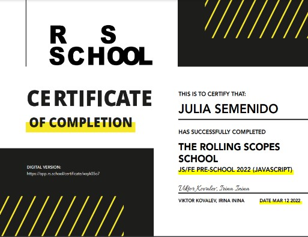

# Julia Semenido


### Contacts

* location: Tbilisi, Georgia
* phone number: +375295982306 / +995595108746
* email: semenido.1997@gmail.com
* discord: @semjul

*************************************************************

### Info

***Goal***: to study a new demanded profession  
***Strengths***: communication skills, problem solving, quick learning

***********************************************************************

### Skills

* HTML, CSS
* JavaScript
* Markdown
* Git, GitHub
* VS Code

***************************************************************************

### Code example

Example from my pet project:
```
function preloadImages() {
  const seasons = ['winter', 'spring', 'summer', 'autumn'];
  for(let i = 1; i <= 6; i++) {
    const img = new Image();
    seasons.forEach((season) => img.src = `./assets/img/${season}/img${i}.jpg`);
  }
}
```

### GitHub repositories

* [CV](https://github.com/Juliasemenido/rsschool-cv)

### Projects

* [Portfolio](https://rolling-scopes-school.github.io/juliasemenido-JSFEPRESCHOOL/portfolio/)
* [Eco-sounds](https://rolling-scopes-school.github.io/juliasemenido-JSFEPRESCHOOL/eco-sounds/)
* [Randon jokes](https://rolling-scopes-school.github.io/juliasemenido-JSFEPRESCHOOL/random-jokes/)

*************************************************************************************
### Education

* Polotsk State University - Educator (2018)
* Polotsk State University - Economist (2020)

#### Courses
* RS Schools Course «JavaScript/Front-end. Stage 0»
> 
* RS Schools Course «JavaScript/Front-end. Stage 1» (in progress)

### Languages

* Belarusian/Russian: Native
* English: [International House](https://www.ih.by/) A1
* German: A1